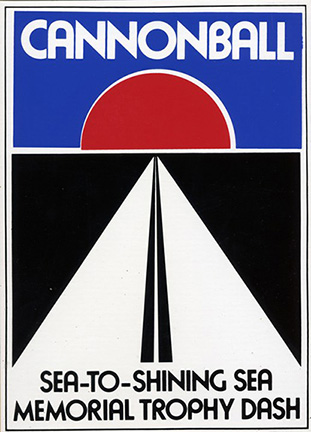
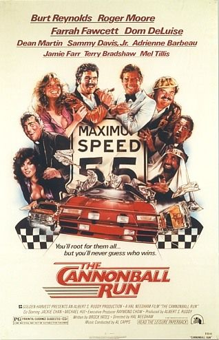

```{r, warning=F, echo=F}
suppressMessages(library(dplyr))
suppressMessages(library(plotly))

cannonball <- read.table('data/bolian.report2.tsv',sep='\t',header=T, fill=T, stringsAsFactors = F)
cannonball <- filter(cannonball, !grepl('US-[A-Z]+',Location.Name)==F)
cannonball$State <- gsub('US-', '', unlist(lapply(strsplit(cannonball$Location.Name, split=', '), 
              function(x) x[grepl('US-[A-Z]+',x)])))
cannonball$id <- 1:nrow(cannonball)

f <- list(
  #family = "Courier New, monospace",
  size = 18,
  color = "black"
)
```

***

###Introduction  
On **October 19th, 2013**, car racing enthuiast and thorough menace to public safety <strong>Ed Bolian</strong> drove a <strong>2004 Mercedes Benz CL 55 AMG</strong> from <strong>E. 31st St. New York, New York</strong> to <strong>Redondo Beach, California</strong> in under <strong>29 hours</strong>. In doing so, he set a new world record for the highly illegal and discontinued <i>Cannonball Sea-to-Shining Sea Trophy Dash</i>. His team participated in this dash alone with no other opponents and made all of their data public in an **[Excel file](http://edbolian.com/wp-content/uploads/2014/10/bolian-report.xlsx)**.

The question concerning this paper is whether it can be quantitatively proven that a man driving a world record time in 2013 would have **beaten Burt Reynolds in a fictional race that took place in 1981** and captured in the film **_The Cannonball Run_**.

<center></center>
<br />

###The Absence of Data Parity
In a very real way, Ed Bolian and the characters in **_The Cannonball Run_** covered the same ground. The size of the continent and position of states have remained fairly consistent over the last 32 years. Nevertheless, some things have definitely changed. For example, the US population has swelled by roughly **87 million**, and the speed limit is **no longer universally 55 mph**.

Now it's unclear how to quantify the affects of the former and given that the point of the race is to flout speed limits, the relevance of the latter is also unclear. **Also difficult to measure are the distractions** endured by the characters of **_The Cannonball Run_** and how they would have affected Bolian were he among those 1981 racers.

These distractions include, but are not limited to:

  * sabotage -- flattened tires and false complaints of sexual impropriety being lodged with local law enforcement
  * a 40-man donnybrook
  * kidnapping
  * oil slicks
  * drunk driving
  * frequent female objectification
  * multiple personality disorder
  * Stockholm syndrome
  * intra-race gambling
  * attempted rape
  * Jack Elam
  * disgraceful racial stereotypes

Clearly a dearth of data complicates the ability to statistically compare Ed Bolian's extremely well-documented journey vs. **Burt Reynold's** 1981 race, which was frankly rather poorly documented in **_The Cannonball Run_**.

###The Cannonball Run Paradox
The **Cannonball Run Paradox** is equivalent to what, in literary circles, might be called the _unreliable narrator_. The only source of data we have about the film's race is from **factory-issued specifications** for the cars featured in the movie and from the **characters' dialogue**. Unfortunately, **these two things don't always agree**.

Below is a scatterplot that graphs each vehicle by its horsepower (bhp) vs. its torque (lb-ft). Included is also Bolian's **2004 Mercedes**, which clearly is in a class by itself and could possibly have overwhelmed the 1981 competition as far as power is concerned.

```{r, warning=F, echo=F}

cars <- read.table('data/cannonball.tsv', sep='\t', fill= T, stringsAsFactors = F, header = T)
t <- list(
  family = "sans serif",
  size = 18,
  color = toRGB("grey50")
)
x <- list(
  title = "Horse Power",
  titlefont = f
)
y <- list(
  title = "Torque (lb-ft)",
  titlefont = f
)

plot_ly(cars, x = bph, y = torque.lbs.ft, text = car, mode = "markers+text",
        textfont = t, textposition = "top middle") %>%
  layout(title='<b>The Mercedes Benz CL 55 AMG is a powerful car</b>', textfont=f, xaxis=x, yaxis=y)
```

Furthermore, the **2004 Mercedes CL 55 AMG** would have enjoyed the second best fuel consumption (mpg) and the highest top speed (mph).

```{r, warning=F, echo=F}
x <- list(
  title = "Top Speed (mph)",
  titlefont = f
)
y <- list(
  title = "Fuel Consumption (mpg)",
  titlefont = f
)

plot_ly(cars, x = top.speed, y = mpg, text = car, mode = "markers+text",
        textfont = t, textposition = "top middle") %>%
  layout(title='<b>The Mercedes also enjoys the second-best gas mileage<br />and the highest top speed</b>', textfont=f, xaxis=x, yaxis=y)

```

But though this data is useful, it is not necessarily authoritative. Subaru may have documented that Jackie Chan's GL could only reach a top speed of **93 mph**; however, in the film, a rocket engine is mounted under its hatchback, so it's to be assumed his car could reach top speeds **far exceeding factory expectations**. The plot's **top speeds are further complicated by data gleaned from the movie's dialogue**: Sheik Abdul ben Falafel (Jamie Farr) announces to a comely roadside waitress that his **Rolls Royce Silver Shadow** can run as fast as 140 mph and Jill Rivers (Tara Buckman) tells Jamie Blake (Dean Martin) that her **Lamborghini Countach** goes 220 mph. Both these speeds conflict with the data plotted above.

It stands to reason that **_The Cannonball Run_** racers would have **modified their cars for a sporting advantage**. The same is true for Bolian in 2013; he added two 23-gallon fuel tanks to limit the number of time's he'd need to stop for gas.

**The next issue to discuss is the route itself.** Below we can see exactly what route Ed Bolian chose in 2013.

```{r, warning=F,echo=F}
geo <- list(
  scope = 'usa',
  projection = list(type = 'albers usa'),
  showland = TRUE,
  landcolor = toRGB("gray95"),
  subunitcolor = toRGB("gray85"),
  countrycolor = toRGB("gray85"),
  countrywidth = 0.5,
  subunitwidth = 0.5
)


plot_ly(cannonball, lon = Longitude, lat = Latitude, text = paste(Location.Name, '<br>Speed: ', Speed), 
        type = 'scattergeo',
        locationmode = 'USA-states', marker = list(size = 2, color = 'red'), mode='markers',
        inherit = FALSE) %>%
  add_trace(lon = lon, lat = lat, data=data.frame(lat = 32.2217, lon ="-110.9264"), 
            marker = list(size=8, color='black', symbol='cross'),
            type = 'scattergeo', locationmode = 'USA-states', 
            text='Tucson, Arizona') %>%
  add_trace(lon = lon, lat = lat, data=data.frame(lat=33.8564, lon ="-118.3769"), 
            marker = list(size=8, color='red', symbol='circle'),
            type = 'scattergeo', locationmode = 'USA-states', text='Redondo Beach, California') %>%
  add_trace(lon = lon, lat = lat, data=data.frame(lat=40.7127, lon="-74.0059"), 
            marker = list(size=8, color='red', symbol='circle'),
            type = 'scattergeo', locationmode = 'USA-states', text='New York, New York') %>%
  layout(title = '<b>A visual representation of Bolian\' route<br /><span style="font-size:6pt">Hover over red line for Speed and Location data</span></b>', titlefont=f,
         geo = geo, showlegend = FALSE)

```

**Tucson, Arizona** is designated with a black cross. That's because it's important. In the movie, the racers await the clearing of an unidentified roadblock. And during this interlude, an extended altercation with a biker gang erupts. It's never stated explicitly where exactly this fight takes place, but the filming location of this scene was **Tucson**, which is nowhere near Bolian's course. More confounding is that Marcie Thatcher (Adrienne Barbeau) tells her teammate Jill that they are 20 minutes from the finish line in **Redondo Beach**.

Redondo Beach is **499.8 miles away from Tucson**. That means that the cars in **_The Cannonball Run_** -- from JJ McClure's **Dodge Tradesman** ambulance to Jill and Marcie's **Lamborghini Countach** -- can all achieve speeds of **1,500 mph**. This seems improbable, but given the nature of the **Cannonball Run Paradox**, it should also be assumed that even Ed Bolian would have traveled through Tucson and been able to achieve such an astounding speed were he competing in the same stretch of the 1981 contest.

(For more visualizations of Bolian's cross-country caper, please refer to the section below titled _The Facts About Bolian's Stunt_.)

###What Data Remains
The 1981 **_Cannonball Run_** eventually distills into a foot race when all the competitors simultaneously arrive at the Redondo Beach pier of the Portofino Hotel marina. And it's here where the most predictive feature reveals itself.

```{r, warning=F, echo=F}
cars.s <-select(cars[c(-7,-10),], -car, -occupants)
cars.s$am <- factor(cars.s$am)
cars.s$won <- factor(cars.s$won)

glm.out<-glm(won ~ female.proportion, family = binomial(link = "logit"), cars.s)

plot(won ~ female.proportion, data=cars.s)
lines(cars.s$female.proportion, glm.out$fitted, type="l", col="red")
title(main="Likelihood of winning increases\nwith proportion of females in the car")
```

Both the 1981 winning team (Jill and Marcie) and the second place team (JJ McClure, Victor Prinzi, Pamela Glover and Dr. Nicolas van Helsing) **boast at least one female occupant in the vehicle**. All other teams tie for third or don't finish at all.

**Note**: Seymour Goldfarb (Roger Moore) travels with multiple, interchangeable female passengers. But as these women do not remain persistent passengers through the duration of the competition, it's to be assumed that their predictive power is diminished.

###Conclusion
Ultimately, it's **inconclusive** whether Ed Bolian from 2013, were he to time travel in his **2004 Mercedes** to 1981, would necessarily win that year's **_Cannonball Run_** even though his car is perhaps stronger than those of his 1981 competition. His desision not to include a female passenger impairs the statistical likelihood that he would have bested Jill and Marcie, or even **Burt Reynolds** for that matter.

###The Facts About Bolian's Stunt
From the gernerously provided data set, it's clear that Ed Bolian was traveling **sociopathically fast** pretty much the entire time and should probably be registered as an **enemy combatant**.
<br />
<br />

```{r, warning=F, echo=F,plotly=T}
x <- list(
  title = "Speed (mph)",
  titlefont = f
)
y <- list(
  title = "Frequency",
  titlefont = f
)
```

He posted a mean speed of **`r round(mean(cannonball$Speed), 2)`** and a median speed of **`r round(median(cannonball$Speed), 2)` mph**. His mode speed was **98**.
<br />
<br />

```{r, warning=F, echo=F}

y <- list(
  title = "Speed (mph)",
  titlefont = f
)

plot_ly(data=cannonball, y=Speed, type='box') %>% layout(yaxis=y) %>% layout(title="<b>Boxplot of Bolian's Speed<br /><span style='font-size:6pt'>Hover for Summary Statistics</span></b>", titlefont=f)

```

Below are the distributions of speeds at which Bolian traveled through each state.
<br />
<br />

```{r, warning=F, echo=F}

plot_ly(cannonball, x = factor(State), y=Speed, type='box') %>% layout(title='<b>Hover over each boxplot for<br />summary statistics from each distribution</b>', titlefont=f)
```

The states it took Ed Bolian the most time to cross are **New Mexico** and **Arizona**.

```{r, warning=F, echo=F}
speed.by.state <- as.data.frame(arrange(summarise(group_by(cannonball, State), median.speed=median(Speed), 
                                    mean.speed=mean(Speed), min.speed=min(Speed), max.speed=max(Speed),
                                    arrived.in.state=min(Reported.At..US.Eastern.),
                                    departed.state=max(Reported.At..US.Eastern.)), 
                          desc(median.speed)))
speed.by.state$duration.sec <- as.vector(difftime(as.POSIXct(speed.by.state$departed.state, format="%Y-%m-%dT%H:%M:%S"), 
         as.POSIXct(speed.by.state$arrived.in.state, format="%Y-%m-%dT%H:%M:%S"), units='sec'))
speed.by.state$duration.min <- speed.by.state$duration.sec/60
speed.by.state$duration.hour <- speed.by.state$duration.min/60
select(arrange(speed.by.state, arrived.in.state), State, duration.min)
```

<br />
<br />

```{r, warning=F, echo=F}
cannonball$time.gap <- 0
cannonball$motion.gap <- 0
cannonball$idle.gap <- 0

cannonball[2:length(cannonball$Reported.At..US.Eastern.),]$time.gap <-
  as.vector(difftime(as.POSIXct(cannonball[2:length(cannonball$Reported.At..US.Eastern.),]$Reported.At..US.Eastern., format="%Y-%m-%dT%H:%M:%S"), 
                     as.POSIXct(cannonball$Reported.At..US.Eastern.[1:length(cannonball$Reported.At..US.Eastern.)-1], format="%Y-%m-%dT%H:%M:%S"), 
                     units='sec'))

cannonball[2:length(cannonball$Reported.At..US.Eastern.),]$motion.gap <-
  as.vector(cannonball[2:length(cannonball$Reported.At..US.Eastern.),]$X4..In.Motion.Time..s. - 
              cannonball$X4..In.Motion.Time..s.[1:nrow(cannonball)-1])

cannonball[2:nrow(cannonball),]$idle.gap <-
  as.vector(cannonball[2:nrow(cannonball),]$X2..Idle.Time..s. - 
              cannonball$X2..Idle.Time..s.[1:nrow(cannonball)-1])

x <- list(
  title = "State",
  titlefont = f
)
y <- list(
  title = "Idle Duration (sec)",
  titlefont = f
)

plot_ly(data.frame(arrange(summarise(group_by(filter(cannonball, idle.gap >0), State), min.time=min(Reported.At..US.Eastern.), idle.gap.sum=sum(idle.gap)), min.time)),
        x=factor(State), y=idle.gap.sum, type='bar') %>% 
  layout(xaxis=x, yaxis=y, title="<b>Far and away, Bolian's longest stop was in Texas</b>",titlefont=f)

```


<center></center>

####Sources
* https://en.wikipedia.org/wiki/The_Cannonball_Run
* http://www.imdb.com/title/tt0082136/
* http://www.ranker.com/list/the-cannonball-run-cars/car-lists?utm_expid=16418821-179.L_j85cRBSIGuH4I7Qr719g.0&utm_referrer=https%3A%2F%2Fwww.google.com%2F
* http://jalopnik.com/meet-the-guy-who-drove-across-the-u-s-in-a-record-28-h-1454092837
* http://jalopnik.com/here-s-the-data-from-ed-bolian-s-record-setting-cross-c-1648466595
* http://www.classiccarsforsale.co.uk/reviews/classic-rolls-royce-reviews/1503/rolls-royce-silver-shadow-review/
* http://www.automobile-catalog.com/make/aston_martin/db5/db5_saloon/1963.html
* https://en.wikipedia.org/wiki/Rolls-Royce_Silver_Shadow
* http://www.automobile-catalog.com/make/chevrolet_usa/monte_carlo_2gen/monte_carlo_2gen/1977.html
* http://www.automobile-catalog.com/make/subaru/leone_1979/leone_1979/1981.html
* http://www.fuelly.com/car/subaru/gl
* http://www.automobile-catalog.com/make/lamborghini/countach/countach_lp400s/1981.html
* http://www.automobile-catalog.com/make/ferrari/308_208_328_gtb_gts/308_gts/1980.html
* http://www.allpar.com/trucks/b-vans.html
* http://www.automobile-catalog.com/car/1975/113060/chevrolet_chevelle_laguna_type_s-3_coupe_454_v-8_turbo-jet_hydra-matic.html
* http://www.automobile-catalog.com/car/2004/1534865/mercedes-benz_cl_55_amg.html
* http://www.zeroto60times.com/vehicle-make/subaru-0-60-mph-times/
* https://www.google.com/webhp?sourceid=chrome-instant&ion=1&espv=2&ie=UTF-8#q=distance%20from%20tucson%20to%20redondo%20beach
* http://www.mto.gov.on.ca/english/dandv/driver/handbook/section2.11.1.shtml
